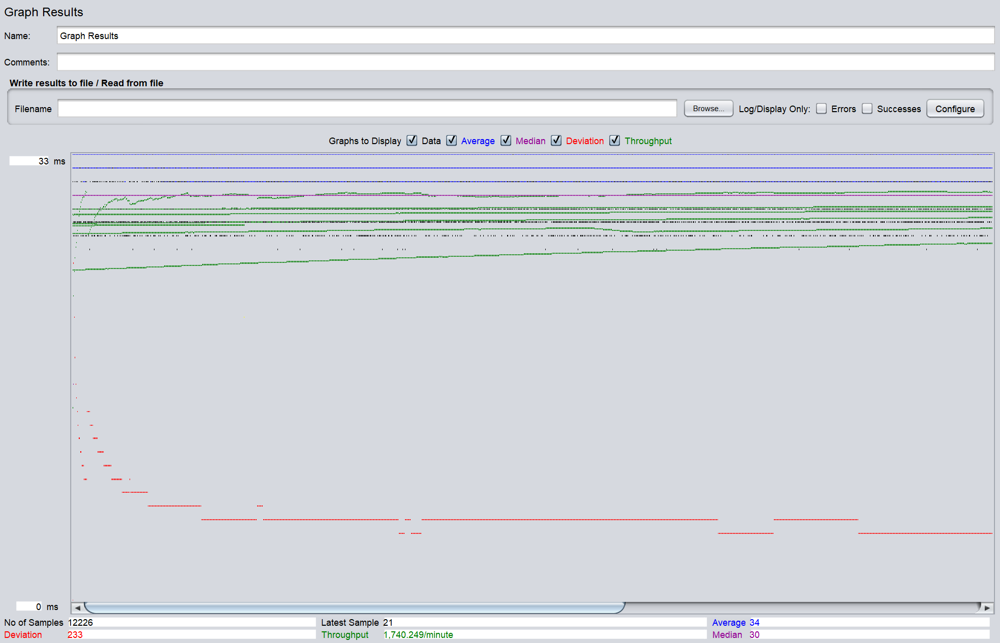
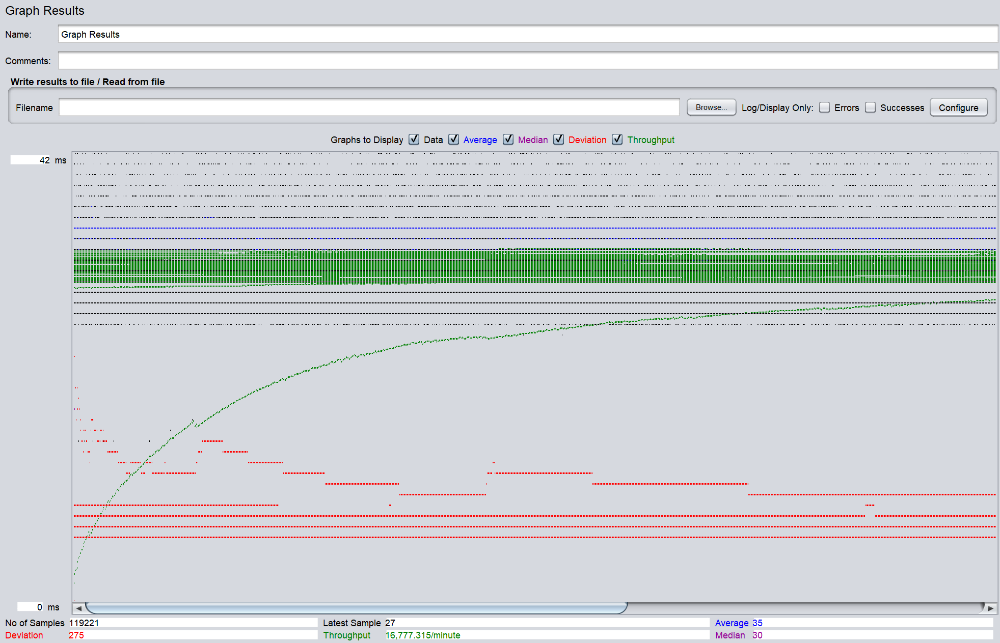
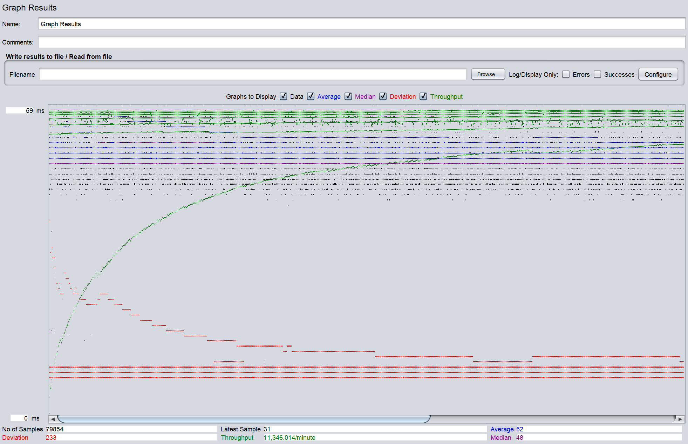
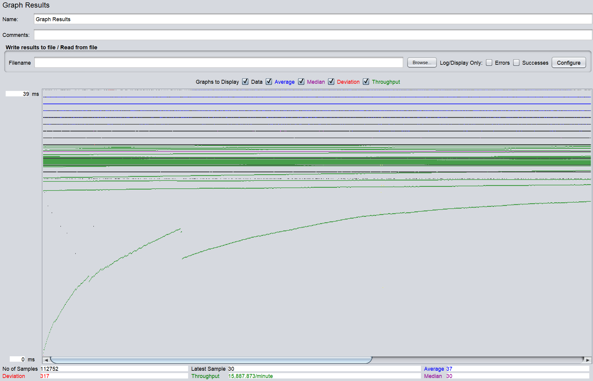

- # General
    - #### Team#: v
    
    - #### Names: Vanessa, Haver
    
    - #### Project 5 Video Demo Link: `insert link here`

    - #### Instruction of deployment:
      - #### TomCat
        **Username:** `admin` **Password:** `mypassword`
      - #### MySQL
        **Username:** `mytestuser` **Password:** `My6$Password` **Create Database File:** `create_table.sql` **Stored Procedures File:** `stored-procedure.sql` **Create Index File:** `create_index.sql`
      - #### Deployment (not sure if this is needed)
           - In both the master and slave instance: 
                - Run `mvn package` in the directory where pom.xml is located. 
                - Then run `cp ./target/*.war /var/lib/tomcat/webapps/` to copy the war file into tomcat/webapps.
           - Set up Apache2 webserver on the load balance instance by creating a load balancer proxy for the master and slave instance and make it so it is configured to enable load balancing, Connection Pooling, and sticky sessions.
      - (add more if needed)
    - #### Collaborations and Work Distribution:
        - Vanessa
            - Log Processing
            - README
        - Haver
            - AWS Setup
            - JMeter Setup

- # Connection Pooling
    - #### Include the filename/path of all code/configuration files in GitHub of using JDBC Connection Pooling.
        - [GenreResultServlet.java](src/GenreResultServlet.java)
        - [StartTitleResultServlet.java](src/StartTitleResultServlet.java)
        - [SearchResultServlet.java](src/SearchResultServlet.java)
        - [SingleMovieServlet.java](src/SingleMovieServlet.java)
        - [SingleStarServlet.java](src/SingleStarServlet.java)
        - [MoviesServlet.java](src/MoviesServlet.java)
        - [PaymentServlet.java](src/PaymentServlet.java)
        - [CartServlet.java](src/CartServlet.java)
        - [ConfirmationServlet.java](src/ConfirmationServlet.java)
        - [MainInitServlet.java](src/MainInitServlet.java)
        - [MetadataServlet.java](src/MetadataServlet.java)
        - [AddGenreServlet.java](src/AddGenreServlet.java)
        - [AddMovieServlet.java](src/AddMovieServlet.java)
        - [AddStarServlet.java](src/AddStarServlet.java)
        - [Autocomplete.java](src/Autocomplete.java)
        - [FulltextServlet.java](src/FulltextServlet.java)
        - [LoginServlet.java](src/LoginServlet.java)
        - [EmployeeLoginServlet.java](src/EmployeeLoginServlet.java)
    
    - #### Explain how Connection Pooling is utilized in the Fabflix code.
        - Any servlet file in the src directory that needs to access the database should be using JDBC Connection Pooling
        - Multiple connections are established with a pool which saves having to open and close a connection each time a computation is done
        - When a connection is need to do a computation, an available connection from the pool is used and then it is put back after the computation is complete
        - (add more)
    
    - #### Explain how Connection Pooling works with two backend SQL.
        - Since there are two backend SQL (Master and Slave), there will be a connection pool for each of them meaning there are two separate connection pools, one for Master and one for Slave
        - For each datasource based on how they are defined in [context.xml](WebContent/META-INF/context.xml):
            - There will be at most 100 connections (maxTotal)
            - If more than 30 connections are not used, some of the connections will be closed to save resources (maxIdle)
            - The connection will timeout and fail after waiting for 10000 ms (maxWaitMillis)
        - (add more)
    

- # Master/Slave
    - #### Include the filename/path of all code/configuration files in GitHub of routing queries to Master/Slave SQL.
        - [context.xml](WebContent/META-INF/context.xml) define the datasources for routing queries
        - These files have their queries routed to the Master SQL because of inserting data into the database:
            - [PaymentServlet.java](src/PaymentServlet.java)
            - [AddGenreServlet.java](src/AddGenreServlet.java)
            - [AddMovieServlet.java](src/AddMovieServlet.java)
            - [AddStarServlet.java](src/AddStarServlet.java)
        - These files have their queries routed to the localhost which is randomized by the load balancer:
            - [Autocomplete.java](src/Autocomplete.java)
            - [CartServlet.java](src/CartServlet.java)
            - [ConfirmationServlet.java](src/ConfirmationServlet.java)
            - [EmployeeLoginServlet.java](src/EmployeeLoginServlet.java)
            - [FulltextServlet.java](src/FulltextServlet.java)
            - [GenreResultServlet.java](src/GenreResultServlet.java)
            - [LoginServlet.java](src/LoginServlet.java)
            - [MainInitServlet.java](src/MainInitServlet.java)
            - [MetadataServlet.java](src/MainInitServlet.java)
            - [MoviesServlet.java](src/MoviesServlet.java)
            - [SearchResultServlet.java](src/SearchResultServlet.java)
            - [SingleMovieServlet.java](src/SingleMovieServlet.java)
            - [SingleStarServlet.java](src/SingleStarServlet.java)
            - [StartTitleResultServlet](src/StartTitleResultServlet.java)

    - #### How read/write requests were routed to Master/Slave SQL?
        - Read requests should go to either the Master or Slave SQL since it does not involve making any changes to the database
        - Write requests should only go to the Master SQL because only changes made in the master will be replicated to the slave and changes in slave will not be replicated to the master, so for when a record is inserted into the databases (ex. payment, adding movie/star/genre) it will directly call the Master SQL to do the insertion so both databases will remain identical
        - (add more)

- # JMeter TS/TJ Time Logs
    - #### Instructions of how to use the [`log_processing.py`](logs/log_processing.py) script to process the JMeter logs.
        - The times in the log files are in ns with each line containing the ts of the query and the tj of the query
        - Make sure the logs to be processed are placed in the logs directory
        - Either one or two logs can be provided as input
        - Cd into the [logs](logs) directory: `cd logs`
        - For the case for single instance run `python log_processing.py single.txt` (assuming the file name is single.txt) in the terminal
        - For the case for scaled instance run `python log_processing.py master.txt slave.txt` (assuming the files names are master.txt and slave.txt) in the terminal
        - The average TS and average TJ times will calculated from looking through the logs provided and the final results will printed out into the terminal

- # JMeter TS/TJ Time Measurement Report

| **Single-instance Version Test Plan**          | **Graph Results Screenshot** | **Average Query Time(ms)** | **Average Search Servlet Time(ms)** | **Average JDBC Time(ms)** | **Analysis** |
|------------------------------------------------|------------------------------|----------------------------|-------------------------------------|---------------------------|--------------|
| Case 1: HTTP/1 thread                          |    | 34                         | 2.3827870518651832                  | 2.0868950099803665        | ??           |
| Case 2: HTTP/10 threads                        |   | 35                         | 2.690676658394369                   | 2.469576564840217         | ??           |
| Case 3: HTTPS/10 threads                       |  | 52                         | 2.791398990755587                   | 2.228219503569997         | ??           |
| Case 4: HTTP/10 threads/No connection pooling  | | 37                         | 3.0634857221497707                 | 2.4360997822461163        | ??           |

| **Scaled Version Test Plan**                   | **Graph Results Screenshot** | **Average Query Time(ms)** | **Average Search Servlet Time(ms)** | **Average JDBC Time(ms)** | **Analysis** |
|------------------------------------------------|------------------------------|----------------------------|-------------------------------------|---------------------------|--------------|
| Case 1: HTTP/1 thread                          |    | ??                         | ??                                  | ??                        | ??           |
| Case 2: HTTP/10 threads                        |    | ??                         | ??                                  | ??                        | ??           |
| Case 3: HTTP/10 threads/No connection pooling  |    | ??                         | ??                                  | ??                        | ??           |

- # Additional Notes from Previous Projects
  ### Substring Matching Design
    - %AB%: For a query 'AB', it will return all strings the contain the pattern 'AB' in the results
    - LIKE '%AB%'
  ### Files with Prepared Statements
    - [GenreResultServlet.java](src/GenreResultServlet.java)
    - [StartTitleResultServlet.java](src/StartTitleResultServlet.java)
    - [SearchResultServlet.java](src/SearchResultServlet.java)
    - [SingleMovieServlet.java](src/SingleMovieServlet.java)
    - [SingleStarServlet.java](src/SingleStarServlet.java)
    - [MoviesServlet.java](src/MoviesServlet.java)
    - [PaymentServlet.java](src/PaymentServlet.java)
    - [CartServlet.java](src/CartServlet.java)
    - [ConfirmationServlet.java](src/ConfirmationServlet.java)
    - [MainInitServlet.java](src/MainInitServlet.java)
    - [MetadataServlet.java](src/MetadataServlet.java)
    - [AddGenreServlet.java](src/AddGenreServlet.java)
    - [AddMovieServlet.java](src/AddMovieServlet.java)
    - [AddStarServlet.java](src/AddStarServlet.java)
  ### Stored Procedures
    - Existing Star: Both the star name and the star birth year inputted matches a star in the database
    - Existing Movie: The title, director, and year inputted matches a movie in the database
    - Existing Genre: The name inputted matches a genre in the database
  ### XMLParser
  There is a [README file](xmlParser/README.md) in the xmlParser directory that details what each inconsistency file contains and what assumptions were made when parsing the xml files.
