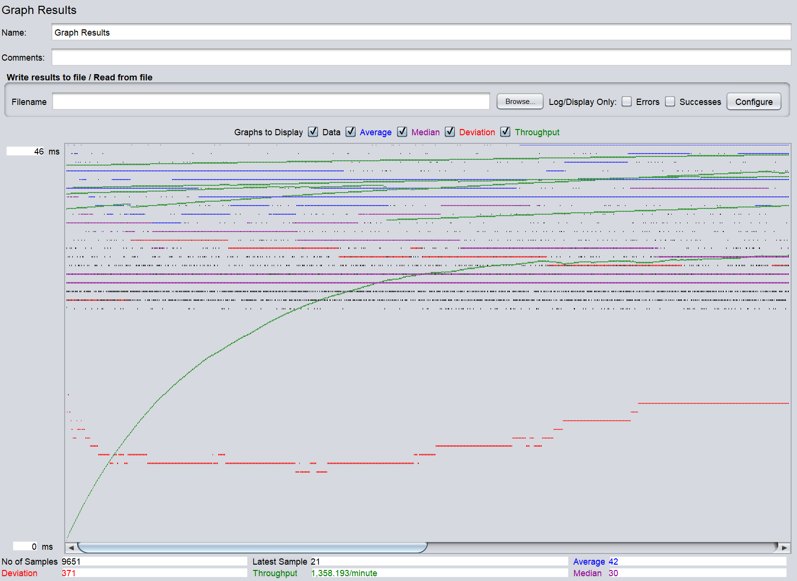
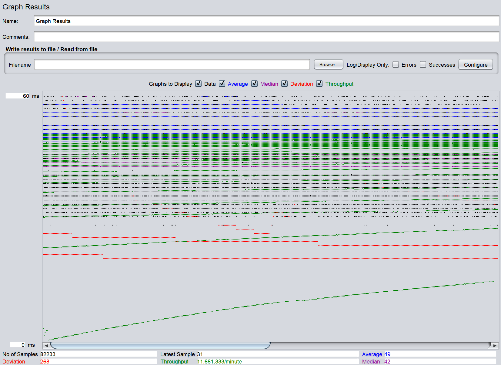
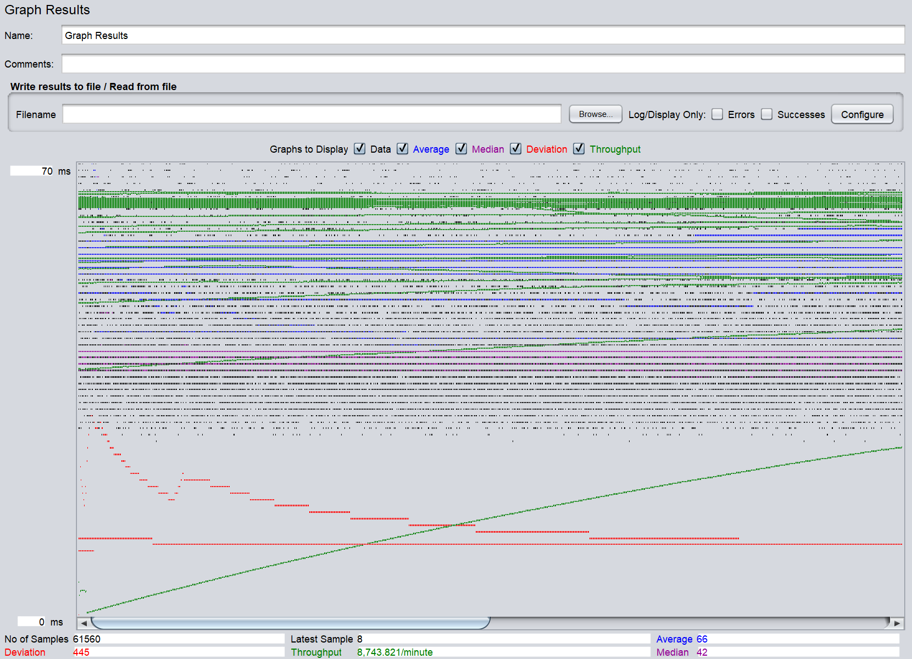

# Fabflix

## About
TODO

## Configuration
### TomCat
  - **Username:** `admin`
  - **Password:** `mypassword`
### MySQL
  - **Username:** `mytestuser`
  - **Password:** `My6$Password`
#### Instructions
  1. Create the database
     ```
     mysql -u mytestuser -p < create_table.sql
     ```
  2. Update the sales table
     ```
     mysql -u mytestuser -p < update_sales_table.sql
     ```
  3. Add stored procedures
     ```
     mysql -u mytestuser -p < stored-procedure.sql
     ```
  5. Create indexes
     ```
     mysql -u mytestuser -p < create_index.sql
     ```

## Deployment
### AWS
#### Single Instance
  - Run `mvn package` in the directory where pom.xml is located
  - Then run `cp ./target/*.war /var/lib/tomcat/webapps/` to copy the war file into tomcat/webapps
#### Scaling up
  - In both the master and slave instance:
    - Run `mvn package` in the directory where pom.xml is located
    - Then run `cp ./target/*.war /var/lib/tomcat/webapps/` to copy the war file into tomcat/webapps
  - Set up Apache2 webserver on the load balance instance by creating a load balancer proxy for the master and slave instance and make it so it is configured to enable load balancing, Connection Pooling, and sticky sessions
### Android
  - If the server is running on localhost, the Android app should be able to run properly without needing any changes
  - If the server is running on AWS, the urls will need to be changed in each of the files so it can make calls to the server

## Walkthrough
### Fabflix Desktop
  - Fabflix Desktop General User Demo: [https://youtu.be/8nQBS5R8PmY](https://youtu.be/8nQBS5R8PmY)
  - YouTube Playlist of Previous Demos: [https://www.youtube.com/playlist?list=PL1J9ZWxAQEApzhaZzw-9r8DWgL3SLbRZs](https://www.youtube.com/playlist?list=PL1J9ZWxAQEApzhaZzw-9r8DWgL3SLbRZs)
### Fabflix Mobile


## Contributors
Vanessa Tang

Haver Ho

## Previous READMEs
<details>
    <summary>Project 5 README</summary>
    
- # General
    - #### Team#: v
    
    - #### Names: Vanessa, Haver
    
    - #### Project 5 Video Demo Link: https://www.youtube.com/watch?v=8HXejHavZqo

    - #### Instruction of deployment:
      - #### TomCat
        **Username:** `admin`<br>**Password:** `mypassword`
      - #### MySQL
        **Username:** `mytestuser`<br>**Password:** `My6$Password`<br>**Create Database File:** `create_table.sql`<br>**Stored Procedures File:** `stored-procedure.sql`<br>**Create Index File:** `create_index.sql`
      - #### Deployment
           - In both the master and slave instance: 
                - Run `mvn package` in the directory where pom.xml is located. 
                - Then run `cp ./target/*.war /var/lib/tomcat/webapps/` to copy the war file into tomcat/webapps.
           - Set up Apache2 webserver on the load balance instance by creating a load balancer proxy for the master and slave instance and make it so it is configured to enable load balancing, Connection Pooling, and sticky sessions.
    - #### Collaborations and Work Distribution:
        - Vanessa
            - Log Processing
            - README
        - Haver
            - AWS Setup
            - JMeter Setup


- # Connection Pooling
    - #### Include the filename/path of all code/configuration files in GitHub of using JDBC Connection Pooling.
        - [GenreResultServlet.java](src/GenreResultServlet.java)
        - [StartTitleResultServlet.java](src/StartTitleResultServlet.java)
        - [SearchResultServlet.java](src/SearchResultServlet.java)
        - [SingleMovieServlet.java](src/SingleMovieServlet.java)
        - [SingleStarServlet.java](src/SingleStarServlet.java)
        - [MoviesServlet.java](src/MoviesServlet.java)
        - [PaymentServlet.java](src/PaymentServlet.java)
        - [CartServlet.java](src/CartServlet.java)
        - [ConfirmationServlet.java](src/ConfirmationServlet.java)
        - [MainInitServlet.java](src/MainInitServlet.java)
        - [MetadataServlet.java](src/MetadataServlet.java)
        - [AddGenreServlet.java](src/AddGenreServlet.java)
        - [AddMovieServlet.java](src/AddMovieServlet.java)
        - [AddStarServlet.java](src/AddStarServlet.java)
        - [Autocomplete.java](src/Autocomplete.java)
        - [FulltextServlet.java](src/FulltextServlet.java)
        - [LoginServlet.java](src/LoginServlet.java)
        - [EmployeeLoginServlet.java](src/EmployeeLoginServlet.java)
    
    - #### Explain how Connection Pooling is utilized in the Fabflix code.
        - Any servlet file in the src directory that needs to access the database should be using JDBC Connection Pooling
        - Multiple connections are established with a pool which saves having to open and close a connection each time a computation is done
        - When a connection is need to do a computation, an available connection from the pool is used and then it is put back after the computation is complete
    
    - #### Explain how Connection Pooling works with two backend SQL.
        - Since there are two backend SQL (Master and Slave), there will be a connection pool for each of them meaning there are two separate connection pools, one for Master and one for Slave
        - For each datasource based on how they are defined in [context.xml](WebContent/META-INF/context.xml):
            - There will be at most 100 connections (maxTotal)
            - If more than 30 connections are not used, some of the connections will be closed to save resources (maxIdle)
            - The connection will timeout and fail after waiting for 10000 ms (maxWaitMillis)
    

- # Master/Slave
    - #### Include the filename/path of all code/configuration files in GitHub of routing queries to Master/Slave SQL.
        - [context.xml](WebContent/META-INF/context.xml) define the datasources for routing queries
        - These files have their queries routed to the Master SQL because of inserting data into the database:
            - [PaymentServlet.java](src/PaymentServlet.java)
            - [AddGenreServlet.java](src/AddGenreServlet.java)
            - [AddMovieServlet.java](src/AddMovieServlet.java)
            - [AddStarServlet.java](src/AddStarServlet.java)
        - These files have their queries routed to the localhost which is randomized by the load balancer:
            - [Autocomplete.java](src/Autocomplete.java)
            - [CartServlet.java](src/CartServlet.java)
            - [ConfirmationServlet.java](src/ConfirmationServlet.java)
            - [EmployeeLoginServlet.java](src/EmployeeLoginServlet.java)
            - [FulltextServlet.java](src/FulltextServlet.java)
            - [GenreResultServlet.java](src/GenreResultServlet.java)
            - [LoginServlet.java](src/LoginServlet.java)
            - [MainInitServlet.java](src/MainInitServlet.java)
            - [MetadataServlet.java](src/MainInitServlet.java)
            - [MoviesServlet.java](src/MoviesServlet.java)
            - [SearchResultServlet.java](src/SearchResultServlet.java)
            - [SingleMovieServlet.java](src/SingleMovieServlet.java)
            - [SingleStarServlet.java](src/SingleStarServlet.java)
            - [StartTitleResultServlet](src/StartTitleResultServlet.java)

    - #### How read/write requests were routed to Master/Slave SQL?
        - Read requests should go to either the Master or Slave SQL since it does not involve making any changes to the database this is done by the load balancer
        - Write requests should only go to the Master SQL because only changes made in the master will be replicated to the slave and changes in slave will not be replicated to the master, so for when a record is inserted into the databases (ex. payment, adding movie/star/genre) it will directly call the Master SQL to do the insertion so both databases will remain identical

- # JMeter TS/TJ Time Logs
    - #### Instructions of how to use the [`log_processing.py`](logs/log_processing.py) script to process the JMeter logs.
        - The times in the log files are in nanoseconds with each line containing the ts of the query and the tj of the query
        - Make sure the logs to be processed are placed in the logs directory
        - Either one or two logs can be provided as input
        - Cd into the [logs](logs) directory: `cd logs`
        - For the case for single instance run `python log_processing.py single.txt` (assuming the file name is single.txt) in the terminal
        - For the case for scaled instance run `python log_processing.py master.txt slave.txt` (assuming the files names are master.txt and slave.txt) in the terminal
        - The average TS and average TJ times will calculated from looking through the logs provided and the final results will printed out into the terminal


- # JMeter TS/TJ Time Measurement Report

| [**Single-instance Version Test Plan**](logs)  | **Graph Results Screenshot** | **Average Query Time(ms)** | **Average Search Servlet Time(ms)** | **Average JDBC Time(ms)** | **Analysis** |
|------------------------------------------------|------------------------------|----------------------------|-------------------------------------|---------------------------|--------------|
| Case 1: HTTP/1 thread                          |    | 34                         | 2.3827870518651832                  | 2.0868950099803665        | It seems that this case has the fastest time compared to the other cases for the single instance. This is expected because there is only 1 thread so there is not as much traffic on the site.           |
| Case 2: HTTP/10 threads                        |   | 35                         | 2.690676658394369                   | 2.469576564840217         | The average times in this case is higher compared to the single thread case due to it having more threads so there is more traffic on the site. Since it has to serve more users at a time, the time to perform a search takes slightly more time.           |
| Case 3: HTTPS/10 threads                       |  | 52                         | 2.791398990755587                   | 2.228219503569997         | Compared to the other cases, this has the highest average query time. Http is generally faster than https due to its simplicity and https has additional steps it must do to ensure security so loading in information is slower.           |
| Case 4: HTTP/10 threads/No connection pooling  | | 37                         | 3.0634857221497707                 | 2.4360997822461163        | This is the case with the slowest average ts because of the fact that it does not have connection pooling. This makes it so it has to constantly open and close a connection every time it accesses the database which slows it down.          |

| [**Scaled Version Test Plan**](logs)           | **Graph Results Screenshot** | **Average Query Time(ms)** | **Average Search Servlet Time(ms)** | **Average JDBC Time(ms)** | **Analysis** |
|------------------------------------------------|------------------------------|----------------------------|-------------------------------------|---------------------------|--------------|
| Case 1: HTTP/1 thread                          |         | 42                         | 2.1150040801285375                  | 1.8591904174354723        | Out of all the cases, this has the lowest ts/tj time because there is less load/traffic on the site.           |
| Case 2: HTTP/10 threads                        |        | 49                         | 2.97711008777521                    | 2.7791825205936016        | Since there are more threads in this case, there is more traffic so the times are higher than the previous case, but due to the load balancing, the time are still relatively low.           |
| Case 3: HTTP/10 threads/No connection pooling  |     | 66                         | 3.2196646812145446                  | 2.1892558056436013        | This is the slowest because it does not have connection pooling meaning it has to open and close a connection each time it access the database instead of reusing an already open connection like in the previous cases.           |

- # Additional Notes from Previous Projects
  ### Substring Matching Design
    - %AB%: For a query 'AB', it will return all strings the contain the pattern 'AB' in the results
    - LIKE '%AB%'
  ### Files with Prepared Statements
    - [GenreResultServlet.java](src/GenreResultServlet.java)
    - [StartTitleResultServlet.java](src/StartTitleResultServlet.java)
    - [SearchResultServlet.java](src/SearchResultServlet.java)
    - [SingleMovieServlet.java](src/SingleMovieServlet.java)
    - [SingleStarServlet.java](src/SingleStarServlet.java)
    - [MoviesServlet.java](src/MoviesServlet.java)
    - [PaymentServlet.java](src/PaymentServlet.java)
    - [CartServlet.java](src/CartServlet.java)
    - [ConfirmationServlet.java](src/ConfirmationServlet.java)
    - [MainInitServlet.java](src/MainInitServlet.java)
    - [MetadataServlet.java](src/MetadataServlet.java)
    - [AddGenreServlet.java](src/AddGenreServlet.java)
    - [AddMovieServlet.java](src/AddMovieServlet.java)
    - [AddStarServlet.java](src/AddStarServlet.java)
  ### Stored Procedures
    - Existing Star: Both the star name and the star birth year inputted matches a star in the database
    - Existing Movie: The title, director, and year inputted matches a movie in the database
    - Existing Genre: The name inputted matches a genre in the database
  ### XMLParser
  There is a [README file](xmlParser/README.md) in the xmlParser directory that details what each inconsistency file contains and what assumptions were made when parsing the xml files.
</details>
<details>
    <summary>Project 4 README</summary>

# CS122B Project 4
## Instructions
### Deployment
Run `mvn package` in the directory where pom.xml is located.<br>Then run `cp ./target/*.war /var/lib/tomcat/webapps/` to copy the war file into tomcat/webapps.
### Demo
**URL:** `https://youtu.be/SvKjiEYw5qw`
### AWS
**URL:** `https://13.52.75.242:8443/cs122b-project4/`
### TomCat
**Username:** `admin`<br>**Password:** `mypassword`
### MySQL
**Username:** `mytestuser`<br>**Password:** `My6$Password`<br>**Create Database File:** `create_table.sql`<br>**Stored Procedures File:** `stored-procedure.sql`
## Additional Notes
### Substring Matching Design
  - %AB%: For a query 'AB', it will return all strings the contain the pattern 'AB' in the results
  - LIKE '%AB%'
### Files with Prepared Statements
  - [GenreResultServlet.java](src/GenreResultServlet.java)
  - [StartTitleResultServlet.java](src/StartTitleResultServlet.java)
  - [SearchResultServlet.java](src/SearchResultServlet.java)
  - [SingleMovieServlet.java](src/SingleMovieServlet.java)
  - [SingleStarServlet.java](src/SingleStarServlet.java)
  - [MoviesServlet.java](src/MoviesServlet.java)
  - [PaymentServlet.java](src/PaymentServlet.java)
  - [CartServlet.java](src/CartServlet.java)
  - [ConfirmationServlet.java](src/ConfirmationServlet.java)
  - [MainInitServlet.java](src/MainInitServlet.java)
  - [MetadataServlet.java](src/MetadataServlet.java)
  - [AddGenreServlet.java](src/AddGenreServlet.java)
  - [AddMovieServlet.java](src/AddMovieServlet.java)
  - [AddStarServlet.java](src/AddStarServlet.java)
### Stored Procedures
  - Existing Star: Both the star name and the star birth year inputted matches a star in the database
  - Existing Movie: The title, director, and year inputted matches a movie in the database
  - Existing Genre: The name inputted matches a genre in the database
### XMLParser
There is a [README file](xmlParser/README.md) in the xmlParser directory that details what each inconsistency file contains and what assumptions were made when parsing the xml files.
#### Parsing Time Optimization Strategies
  1. We used in memory hash maps to store information from the database and information we plan to insert into the database so we did not have to query against the database constantly in order to find duplicates or to find whether a movie/star/genre already exists. 
  2. We wrote the data that was parsed from the xml files to csv files (one csv file for each table that is going to be inserted into) so we can use LOAD DATA from SQL to load all the information into each of the tables all at once instead of having to send multiple insert queries throughout parsing to the database. 
## Contributions
### Vanessa
  - Full Text(JS)
  - Android Login Page
  - Android Movie List Page
  - Android Single Movie Page
  - Making Revisions/Style Changes to Other Pages
  - Debugging
### Haver
  - Full Text(JS/Servlet)
  - Autocomplete
  - Android Search Page
  - Android Movie List Page
  - Making Revisions/Style Changes to Other Pages
  - Debugging
</details>
<details>
    <summary>Project 3 README</summary>

# CS122B Project 3
## Instructions
### Deployment
Run `mvn package` in the directory where pom.xml is located.<br>Then run `cp ./target/*.war /var/lib/tomcat/webapps/` to copy the war file into tomcat/webapps.
### Demo
**URL:** `https://youtu.be/gNNIp_vyORI`
### AWS
**URL:** `https://54.176.198.22:8443/cs122b-project3/`
### TomCat
**Username:** `admin`<br>**Password:** `mypassword`
### MySQL
**Username:** `mytestuser`<br>**Password:** `My6$Password`<br>**Create Database File:** `create_table.sql`<br>**Stored Procedures File:** `stored-procedure.sql`
## Additional Notes
### Substring Matching Design
  - %AB%: For a query 'AB', it will return all strings the contain the pattern 'AB' in the results
  - LIKE '%AB%'
### Files with Prepared Statements
  - [GenreResultServlet.java](src/GenreResultServlet.java)
  - [StartTitleResultServlet.java](src/StartTitleResultServlet.java)
  - [SearchResultServlet.java](src/SearchResultServlet.java)
  - [SingleMovieServlet.java](src/SingleMovieServlet.java)
  - [SingleStarServlet.java](src/SingleStarServlet.java)
  - [MoviesServlet.java](src/MoviesServlet.java)
  - [PaymentServlet.java](src/PaymentServlet.java)
  - [CartServlet.java](src/CartServlet.java)
  - [ConfirmationServlet.java](src/ConfirmationServlet.java)
  - [MainInitServlet.java](src/MainInitServlet.java)
  - [MetadataServlet.java](src/MetadataServlet.java)
  - [AddGenreServlet.java](src/AddGenreServlet.java)
  - [AddMovieServlet.java](src/AddMovieServlet.java)
  - [AddStarServlet.java](src/AddStarServlet.java)
### Stored Procedures
  - Existing Star: Both the star name and the star birth year inputted matches a star in the database
  - Existing Movie: The title, director, and year inputted matches a movie in the database
  - Existing Genre: The name inputted matches a genre in the database
### XMLParser
There is a [README file](xmlParser/README.md) in the xmlParser directory that details what each inconsistency file contains and what assumptions were made when parsing the xml files.
#### Parsing Time Optimization Strategies
  1. We used in memory hash maps to store information from the database and information we plan to insert into the database so we did not have to query against the database constantly in order to find duplicates or to find whether a movie/star/genre already exists. 
  2. We wrote the data that was parsed from the xml files to csv files (one csv file for each table that is going to be inserted into) so we can use LOAD DATA from SQL to load all the information into each of the tables all at once instead of having to send multiple insert queries throughout parsing to the database. 
## Contributions
### Vanessa
  - reCaptcha Error Message
  - HTTPS
  - Encrypted Password Changes
  - Prepared Statements
  - Employees Login Filter
  - Dashboard Home (HTML/CSS)
  - Stored Procedures
  - Add Star Servlet
  - Add Genre Servlet
  - Add Movie Page (HTML/CSS)
  - Add Star Page (HTML/CSS/JS)
  - Add Genre Page (HTML/CSS/JS)
  - xmlParser
  - Making Revisions/Style Changes to Other Pages
  - Debugging
### Haver
  - reCaptcha Setup
  - Encrypted Password Changes
  - Employees Login (HTML/CSS/JS)
  - Employees Login Servlet/Filter
  - Dashboard Home (HTML/CSS/JS)
  - Metadata Servlet
  - Stored Procedures
  - Add Movie Servlet
  - Add Movie Page (HTML/CSS/JS)
  - Add Star Page (HTML/CSS)
  - Add Genre Page (HTML/CSS)
  - xmlParser
  - Making Revisions/Style Changes to Other Pages
  - Debugging
</details>
<details>
    <summary>Project 2 README</summary>
    
# CS122B Project 2
## Instructions
### Deployment
Run `mvn package` in the directory where pom.xml is located.<br>Then run `cp ./target/*.war /var/lib/tomcat/webapps/` to copy the war file into tomcat/webapps.
### Demo
**URL:** `https://youtu.be/tFqOc9hKA5c`
### AWS
**URL:** `http://54.215.234.136:8080/cs122b-project2/`
### TomCat
**Username:** `admin`<br>**Password:** `mypassword`
### MySQL
**Username:** `mytestuser`<br>**Password:** `My6$Password`<br>**Create Database File:** `create_table.sql`
## Additional Notes
### Substring Matching Design
  - %AB%: For a query 'AB', it will return all strings the contain the pattern 'AB' in the results
  - LIKE '%AB%'
## Contributions
### Vanessa
  - Login Page (JS)
  - Login Filter/Login Servlet
  - Main Page (JS)
  - Main Page Servlet
  - Confirmation Page (HTML/JS)
  - Confirmation Page Servlet
  - Payment Page (HTML/CSS/JS)
  - Payment Page Servlet
  - Cart Page (HTML/JS)
  - Cart Page Servlet
  - Pagenation/Sorting
  - Modifying SQL Queries
  - Making Revisions/Style Changes to Other Pages
  - Debugging
### Haver
  - Login Page (HTML/CSS)
  - Main Page (HTML/CSS)
  - Main Page Servlet
  - Confirmation Page Servlet
  - Payment Page Servlet
  - Cart Page Servlet
  - Genre Results Servlet
  - Start Title Servlet
  - Search Result Servlet
  - Modifying SQL Queries
  - Making Revisions/Style Changes to Other Pages
  - Debugging
</details>
<details>
    <summary>Project 1 README</summary>

# CS122B Project 1
## Instructions
### Deployment
Run `mvn package` in the directory where pom.xml is located.<br>Then run `cp ./target/*.war /var/lib/tomcat/webapps/` to copy the war file into tomcat/webapps.
### Demo
**URL:** `https://youtu.be/qxnNAQztqiU` 
### AWS
**URL:** `http://54.67.91.117:8080/cs122b-project1`
### TomCat
**Username:** `admin`<br>**Password:** `mypassword`
### MySQL
**Username:** `mytestuser`<br>**Password:** `My6$Password`<br>**Create Database File:** `create_table.sql`
## Contributions
### Vanessa
  - SQL Tables
  - Project Setup
  - Single Move Page, Single Star Page (HTML/js)
  - CSS Stylesheet
  - Making Revisions/Style Changes to Other Pages
  - Debugging
### Haver
  - SQL Tables
  - Servlets
  - Top 20 Page (HTML/js)
  - CSS Stylesheet
  - Making Revisions/Style Changes to Other Pages
  - Debugging
</details>
